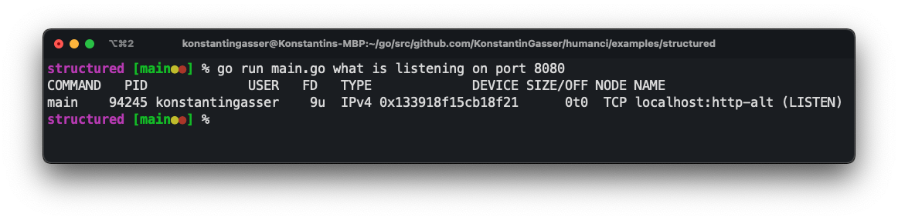
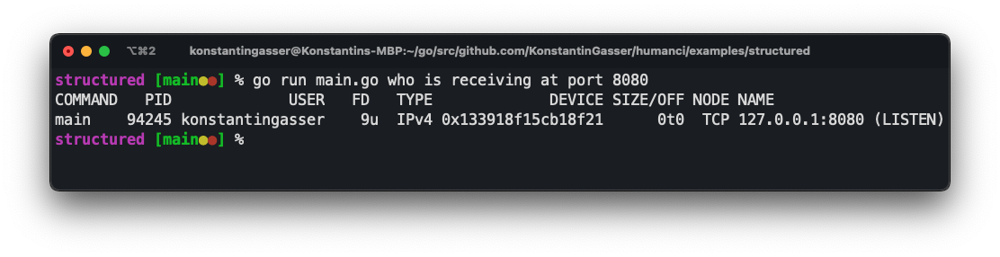

# humanci 👉 🤖 👈

## First things first

`humanci` is most likely not a CLI-Framework to realistically replace any of the current ones. Why? Well because in `humanci` we don't know anything about `flags`, `args` nor `sub-commands`.
Welll kind of. With `humanci` you can build `CLI-Tools` which commands can be spelled in a fluent language. Let me give you an example. I sometimes need to check which web-server I forgot
to stop and is now block port 8080. However, I takes me 3 google searches and 4 Safari tabs to find the `lsof -i tcp:8080` command to release my pain. `humanci` should allow you to build something where you can just type in `which process is listening on 8080`. 

This whole thing is meant to be a fun project rather than a project to build the most efficient and performant CLI-Framework. If you are looking for one of those go check out [cobra](https://github.com/spf13/cobra), pretty awesome! 

I'd like to quote my roommate how said:
> *"It might be slow, maybe quite slow - but humans, humans are super slow"*


## Example

```go 
func main() {
    // create a new cli which is a singelton
    // humanci.New() can be called multiple times returning the current
    // instance if one exists else creates one
	cli := humanci.New()

	cli.RootNOP("who", "what"). // set the root "command". Sentence can start with "who" or "what"
		WithNOP("is"). // well this is a fill word/node to allow a correct sentence
		WithRegex(HandleAction, "listening|receiving"). // here we can apply a regex on the current token and execute a function with that knowledge 
		WithNOP("on", "at"). // again fill word/node but sentence can now be "who/what is listening/receiving on/at"
		WithNOP("port"). // fill word/node
		WithRegex(HandlePort, "[0-9]{2,4}") // match the user input port (dont use this regex for ports - just used for this example but is not generally correct!)

    // run the command
	if err := cli.Execute(); err != nil {
		log.Fatal(err)
	}
}
```

`WithRegex` requires a `ValueFunc` which can be used to modify the current state of the command.
Here the `HandlerAction` is used to add meta data to the command which can be used in the next nodes.

```go
func HandleAction(meta humanci.MetaData) error {
	switch meta.LastToken() {
	case "listening":
		meta.Value("cmd", "lsof")
		meta.Value("type", "LISTENING")
	case "receiving":
		meta.Value("cmd", "lsof")
		meta.Value("type", "RECEIVING")
	}
	return nil
}
```

The last `ValueFunc` in `WithRegex(HandlePort, "[0-9]{2,4}")` is the handler which executes the correct
shell commands using the meta data from the previous steps.

```go
func HandlePort(meta humanci.MetaData) error {
	port := meta.LastToken()

	switch meta.Return("type") {
	case "LISTENING":
		cmd := exec.Command(meta.Return("cmd").(string), "-i", "tcp:"+port)
		cmd.Stdout = os.Stdout
		cmd.Stderr = os.Stderr

		if err := cmd.Run(); err != nil {
			return err
		}
	case "RECEIVING":
		cmd := exec.Command(meta.Return("cmd").(string), "-nPi", "tcp:"+port)
		cmd.Stdout = os.Stdout
		cmd.Stderr = os.Stderr

		if err := cmd.Run(); err != nil {
			return err
		}
	default:
		fmt.Println("Mhm..sorry I am not sure what to do with this.")
	}
	return nil
}
```

### Output

`go run main.go what is listening on port 8080`


`go run main.go who is receiving at port 8080`
